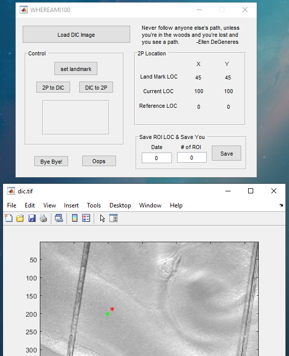

# Simple GUI to locate field of view
### Introduction
When I was doing 2-photon calcium imaging on brain slices, one issue was that it was easy to be lost under the 2-photon image. Because comparing to the widefield image, there are little features to identify the location information, and the field of view is much smaller. To solve this problem, I created this simple Matlab GUI, where I can roughly locate my 2-photon imaging sites on a widefield image. The code is old (when I started the graduate school) and had some assumptions...
### How to use it
Run the GUI in matlab.  
  
Click 'Load DIC Image' to load the widefield image.  
  
Find a feature that is visable in both 2-photon image and widefield image. Click 'set landmark' to click the landmark on the widefield image, then type the (x,y) coordinates of the landmark in 2-photon image. The landmark will be plotted on the image as a green asterisk. The coordinates in the 2-photon image will be displayed on the right.  
  
To locate a field of view under the 2-photon image to the widefield image, click '2P to DIC' and input the (x,y) coordinates of the field of view.  
  
The new field of view will be located on the widefield image as a red asterisk.  
  
To estimate the (x,y) coordinates in the 2-photon image from a location on the widefield image, click 'DIC to 2P'. Then click the location on the widefield image. The estimated (x,y) coordinates in the 2-photon image will be displayed after 'Current LOC.'  
### Be noted that...
Some parameters such as micro per pixels are hardcoded. I am also assuming there is no rotation between the 2-photon image and the widefield image.  
